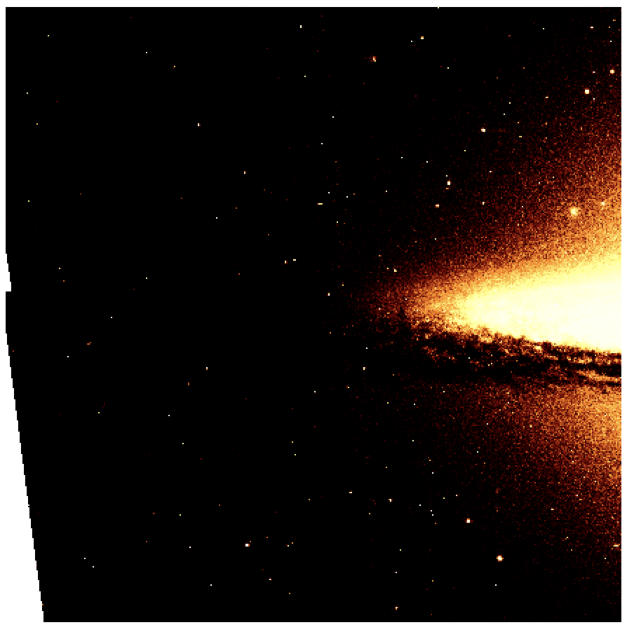

# M104-Peak-Frequency-and-Weins-Law-from-Spectrum
HST legacy archive data, NED, and DS9 were used to produce spectral data and a false color image for the M104 Sombrero Galaxy. This Jupyter Notebook plots the spectral data and calculates the peak frequency as well as Wein's Law.

